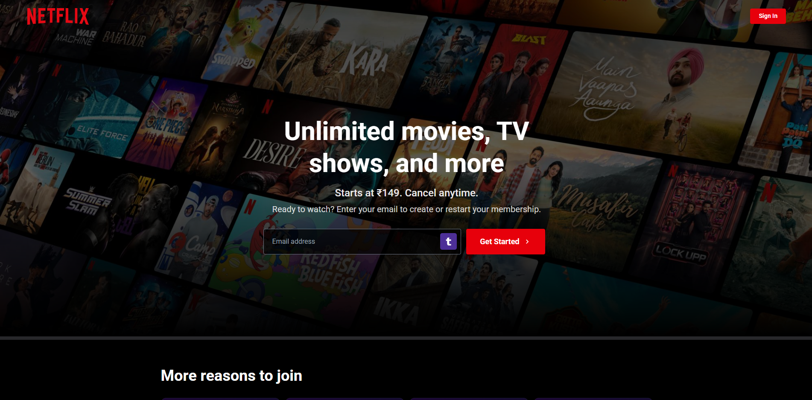
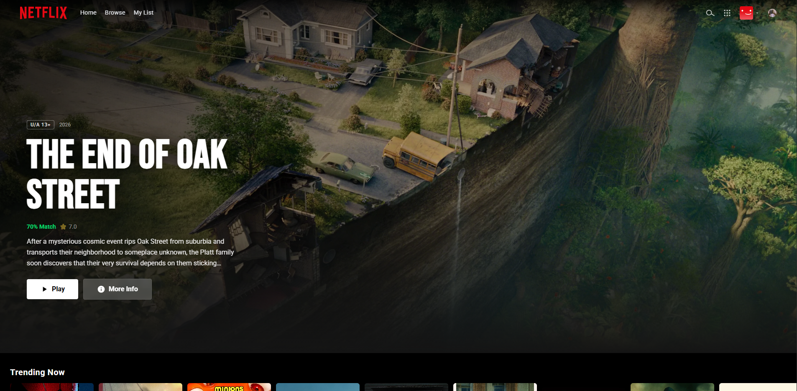
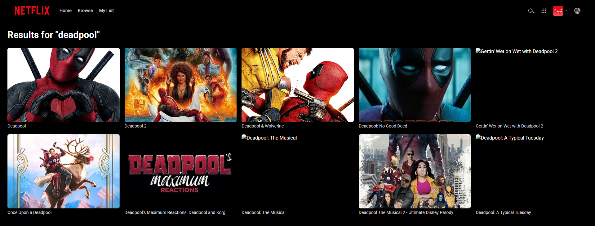
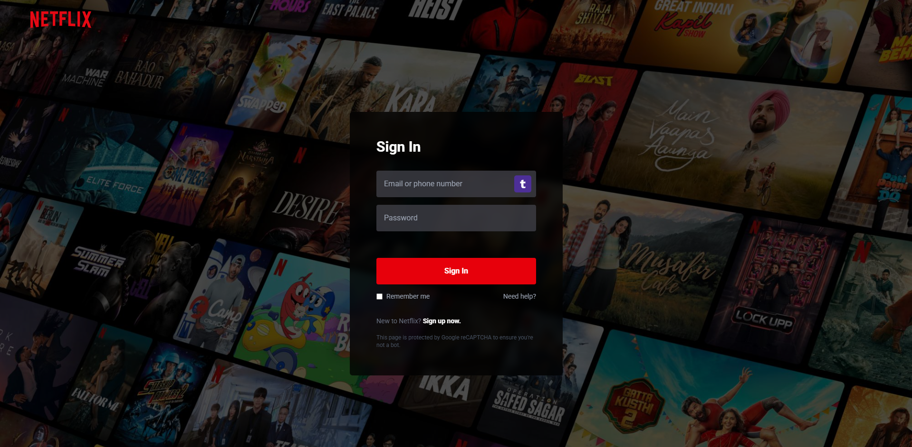

# 🎬 Netflix Clone

A full-featured Netflix-inspired streaming web application built with React, Firebase, and the OMDb API. This isn't just another basic clone — it has real authentication, route protection, a full Netflix India-style landing page, cloud-synced watchlist in Firestore, live search, and a cinematic UI that actually feels like Netflix.

<br/>

<!--  SCREENSHOT PLACEHOLDER — replace with your actual screenshots -->
<!--  -->
<!--  -->
<!--  -->
<!--  -->
<!--  -->

> **Note:** Screenshots can be added by placing images in the `./screenshots/` folder and uncommenting the lines above.

<br/>

---

## ✨ Features

- **Official Netflix India-Style Landing Page** — featuring hero background, email sign-up CTA, "More reasons to join" feature cards with colorful vector icons, and an interactive FAQ accordion.
- **Netflix-Style Login & Sign Up** — sleek translucent centered card layout over cinematic background with validation and error alerts.
- **Route Protection & Auth Guard** — unauthenticated visitors are restricted to the landing/auth pages; protected routes (`/home`, `/browse`, `/watchlist`) require signing in.
- **Netflix-Style Banner** — full-screen hero with layered gradient vignettes, rating badge, match percentage, and working **Play** (trailer) + **More Info** buttons.
- **Movie Rows** — horizontally scrollable rows for Trending, Top Rated, Action, and Comedy categories with custom hidden scrollbars.
- **Live Search** — powered by the OMDb API, search movies/series in real-time with responsive grid results.
- **Authentication** — powered by Firebase Authentication (Email/Password).
- **My List (Watchlist)** — add and remove movies directly from modal, synced to Firestore per-user in real time.
- **Movie Details Modal** — click any movie to see high-res poster, rating, cast, runtime, plot overview, and quick trailer action.
- **Netflix Splash Screen** — authentic intro animation on initial page load.
- **Interactive Navbar & Profile Dropdown** — expandable search bar, quick category links, and account dropdown with sign-out.
- **Responsive Design** — pixel-perfect on mobile, tablet, and desktop screens.

<br/>

---

## 🛠️ Tech Stack

| Layer | Technology |
|---|---|
| Frontend Framework | React 19 + Vite 8 |
| Styling | Tailwind CSS v4 (CSS-first configuration) |
| Authentication | Firebase Authentication |
| Database | Firebase Cloud Firestore |
| Movie Data (Home rows) | Local Curated Dataset |
| Live Movie Search | OMDb API |
| Routing | React Router DOM v7 |

<br/>

---

## 📁 Project Structure

```
src/
├── assets/                  # SVGs, icons, Netflix logos, and avatars
├── components/
│   ├── Banner.jsx           # Hero banner with Play + More Info & trailer
│   ├── MovieCard.jsx        # Individual movie poster card
│   ├── MovieModal.jsx       # Movie details popup + watchlist toggle
│   ├── MovieRow.jsx         # Horizontal scrollable movie row
│   ├── Navbar.jsx           # Top navigation bar with search & profile menu
│   ├── ProtectedRoute.jsx   # Route guard for authenticated user access
│   ├── SkeletonCard.jsx     # Loading shimmer placeholder cards
│   └── SplashScreen.jsx     # Netflix intro animation
├── context/
│   └── AuthContext.jsx      # Firebase auth state provider & useAuth hook
├── data/
│   └── movies.json          # Curated movie data for home screen categories
├── pages/
│   ├── Browse.jsx           # Search results & movie discovery page
│   ├── Home.jsx             # Main dashboard with banner & category rows
│   ├── Landing.jsx          # Netflix India-style guest landing page
│   ├── Login.jsx            # Sign in page
│   ├── Signup.jsx           # Registration page
│   └── Watchlist.jsx        # User's saved movies (My List)
└── services/
    ├── firebase.js          # Firebase app, Auth, and Firestore initialization
    ├── omdbApi.js           # OMDb API fetchers & local data handlers
    └── watchlistService.js   # Firestore Watchlist CRUD operations
```

<br/>

---

## 🚀 Getting Started

### 1. Clone the repository

```bash
git clone https://github.com/vedant476/netflix-clone.git
cd netflix-clone
```

### 2. Install dependencies

```bash
npm install
```

### 3. Set up Firebase

1. Go to [Firebase Console](https://console.firebase.google.com/) and create a new project.
2. Under **Build → Authentication**, enable **Email/Password** sign-in method.
3. Under **Build → Firestore Database**, create a database (start in test mode).
4. Go to **Project Settings → Web App** and copy your Firebase configuration.

### 4. Get an OMDb API Key

Go to [omdbapi.com](https://www.omdbapi.com/apikey.aspx) and generate a free API key.

### 5. Configure environment variables

Create a `.env` file in the root directory:

```env
VITE_FIREBASE_API_KEY=your_firebase_api_key
VITE_FIREBASE_AUTH_DOMAIN=your_project.firebaseapp.com
VITE_FIREBASE_PROJECT_ID=your_project_id
VITE_FIREBASE_STORAGE_BUCKET=your_project.appspot.com
VITE_FIREBASE_MESSAGING_SENDER_ID=your_sender_id
VITE_FIREBASE_APP_ID=your_app_id

VITE_OMDB_API_KEY=your_omdb_api_key
```

### 6. Run the local development server

```bash
npm run dev
```

Open [http://localhost:5173](http://localhost:5173) in your browser.

<br/>

---

## 🗄️ Firestore Data Structure

```
users/
  {userId}/
    watchlist/
      {imdbID}/
        imdbID      → string
        Title       → string
        Year        → string
        Poster      → string
        imdbRating  → string
        Genre       → string
        Plot        → string
        addedAt     → ISO date string
```

<br/>

---

## 🔐 Firestore Security Rules

Deploy these security rules to ensure users can only read and write their own watchlist data:

```
rules_version = '2';
service cloud.firestore {
  match /databases/{database}/documents {
    match /users/{userId}/watchlist/{movieId} {
      allow read, write: if request.auth != null && request.auth.uid == userId;
    }
  }
}
```

<br/>

---

## 📋 Roadmap

- [x] Netflix India-style Landing page with FAQ accordion and reasons to join
- [x] Netflix-style Login & Sign Up page UI
- [x] Protected routes preventing unauthorized access
- [x] Cloud Watchlist integration with Firestore
- [ ] Trailer auto-play in modal using YouTube embed
- [ ] Genre filtering on Browse page
- [ ] Continue Watching section with local progress
- [ ] Mobile touch gestures for horizontal carousel rows

<br/>

---

## 👨‍💻 Creator

Built by **[vedant476](https://github.com/vedant476)**

<br/>

---

## 📄 License

This project is for educational and portfolio purposes only. Netflix name, branding, and all related assets are trademarks of Netflix, Inc. This project is not affiliated with or endorsed by Netflix.

---

<p align="center">Built using Keyboard and Mouse</p>
